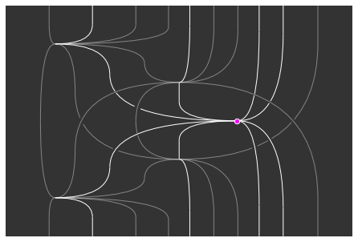
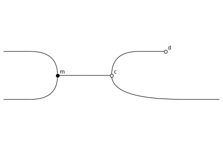

rewalt
======

1. *(archaic)* to overturn, throw down
2. a library for **rew**\ riting, **al**\ gebra, and **t**\ opology, developed in Tallinn (aka **Reval**)

``rewalt`` is a toolkit for **higher-dimensional diagram rewriting**, with applications in

- **higher** and **monoidal category theory**,
- **homotopical algebra**,
- **combinatorial topology**,

and more. Thanks to its visualisation features, it can also be used as a structure-aware **string diagram** editor, supporting `TikZ <https://tikz.net/>`_ output so the string diagrams can be directly embedded in your LaTeX files.

It implements `diagrammatic sets <https://arxiv.org/abs/2007.14505>`_ which, by the "higher-dimensional rewriting" paradigm, double as a model of

- *higher-dimensional rewrite systems*, and of
- *directed cell complexes*.

This model is "topologically sound": a diagrammatic set built in ``rewalt`` presents a finite CW complex, and a diagram constructed in the diagrammatic set presents a valid homotopy in this CW complex.

A diagrammatic set can be seen as a generalisation of a *simplicial set* or of a *cubical set* with many more "cell shapes". As a result, ``rewalt`` also contains a *full implementation* of finitely presented **simplicial sets** and **cubical sets with connections**.

Installation
------------
``rewalt`` is available for Python 3.7 and higher. You can install it with the command

.. code-block:: bash

   pip install rewalt

If you want the bleeding edge, you can check out the `GitHub repository <https://github.com/ahadziha/rewalt>`_.

Getting started
---------------

To get started, we recommend you check the `Notebooks <notebooks/monoids.html>`_, which contain a number of worked examples from category theory, algebra, and homotopy theory.

Further reading 
---------------
For a first introduction to the ideas of higher-dimensional rewriting, diagrammatic sets, and "topological soundness", you may want to watch these presentations at the `CIRM meeting on Higher Structures <https://cirmbox.cirm-math.fr/s/8a8DXyFA4bzaSNF>`_ and at the `GETCO 2022 conference <https://youtu.be/UlVZPiJ87kw>`_.

A nice overview of the general landscape of higher-dimensional rewriting is Yves Guiraud's `mémoire d'habilitation <https://webusers.imj-prg.fr/~yves.guiraud/articles/hdr.pdf>`_.

So far there are two papers on the theory of diagrammatic sets: `the first one <https://arxiv.org/abs/2007.14505>`_ containing the foundations, `the second one <https://arxiv.org/abs/2101.10361>`_ containing some developments applied to categorical universal algebra.

A description and complexity analysis of some of the data structures and algorithms behind ``rewalt`` will be published in the `proceedings of ACT 2022 <https://msp.cis.strath.ac.uk/act2022/>`_.

License
-------
``rewalt`` is distributed under the BSD 3-clause license.

Contributing
------------
Currently, the only active developer of ``rewalt`` is `Amar Hadzihasanovic <https://ioc.ee/~amar>`_.

Contributions are welcome. Please reach out either by sending me an email, or by `opening an issue <https://github.com/ahadziha/rewalt/issues/new>`_.

.. toctree::
   :maxdepth: 3
   :caption: Notebooks
   
   notebooks/monoids
   notebooks/stringdiagrams
   notebooks/simplicescubes
   notebooks/eckmannhilton
   notebooks/presentcategory

.. automodule:: rewalt

.. toctree::
   :maxdepth: 2
   :caption: API

   rewalt/diagrams
   rewalt/shapes
   rewalt/ogposets
   rewalt/strdiags
   rewalt/hasse
   rewalt/drawing

Indices and tables
------------------

* :ref:`genindex`
* :ref:`modindex`
* :ref:`search`
